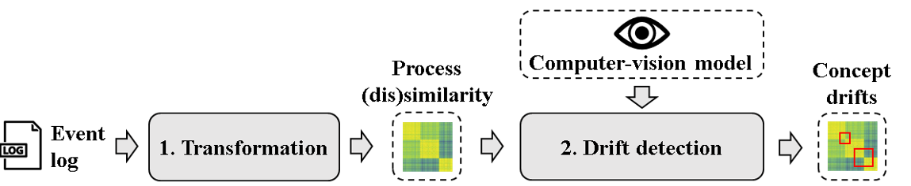

# CV4CDD — Concept Drift Detection

Computer-vision based concept drift detection for Flows & Funds. Detects **sudden**, **gradual**, **incremental**, and **recurring** drifts in an event log by encoding the log as a similarity matrix and running a fine-tuned object-detection model over the resulting image.

Based on *Machine Learning-based Detection of Concept Drifts in Business Processes* (A. Kraus & H. van der Aa, University of Mannheim — BPM'24). The original reference implementation lives under [approaches/object_detection/](approaches/object_detection/); this module is a self-contained, platform-integrated port of that pipeline.

> Licence: CC-BY-4.0 — see [LICENSE.txt](LICENSE.txt).

---

## 1. What it does

Concept drift in process mining is when a single event log contains traces from multiple versions of a process. CV4CDD treats drift detection as an **object-detection problem on images**:

1. Split the log into `N` chronological windows of equal trace count.
2. Build a directly-follows graph (DFG) for each window.
3. Compute pairwise cosine distance between window DFGs → an `N × N` similarity matrix.
4. Render the matrix as a viridis-coloured image.
5. Run a fine-tuned object-detection model — it draws bounding boxes around regions of the image that look like a drift, classified into one of four drift types.
6. Map bounding-box pixel coordinates back to window indices and wall-clock timestamps.

The output is a list of detected drifts with type, confidence, start/end timestamp, plus an overlay PNG of the similarity matrix with bounding boxes drawn on it.



### Drift types

| Type | Colour | Meaning |
|---|---|---|
| `sudden` | white | Abrupt switch from one process version to another at a single point in time. |
| `gradual` | dodgerblue | The new version is introduced alongside the old version for a period; both run in parallel until the old one is retired. |
| `incremental` | magenta | Multiple small changes accumulate over time into a new process version. |
| `recurring` | aqua | The process oscillates between two versions (e.g. seasonal). |

---

## 2. Folder layout

```
modules/cv4cdd/
├── manifest.yaml             # platform registration: requirements, deps, config schema
├── module.py                 # entry point — Module subclass, routes, event hooks
├── cv4cdd_core.py            # the streamlined detection pipeline (encoding + inference)
├── model/
│   └── 20240922-233643_winsim_sgd_model_4d_v1/   # bundled TensorFlow SavedModel
├── panel/
│   ├── index.tsx             # frontend panel (results table + overlay image)
│   └── queries.ts            # React-Query bindings against the module routes
├── approaches/               # original Kraus & van der Aa reference repo (kept for parity)
├── data/                     # sample logs used during development
├── output/                   # local scratch directory
├── pyproject.toml            # optional — synthesised from manifest if absent
└── LICENSE.txt
```

---

## 3. The model

| | |
|---|---|
| **Architecture** | RetinaNet-style object detector from the [TensorFlow Model Garden](https://github.com/tensorflow/models), fine-tuned on synthetic event logs with known drifts. |
| **Bundled snapshot** | `model/20240922-233643_winsim_sgd_model_4d_v1/` (SavedModel format — `saved_model.pb` + `variables/`). Loaded once per process and cached. |
| **Input** | A single `256 × 256` RGB image, JPEG-encoded from a viridis-coloured similarity matrix. |
| **Training input pipeline** | Native `n_windows × n_windows` matrix → JPEG (quality 75, PIL default) → bilinear resize to 256². Keep this exact path: PNG or pre-resized inputs shift detections by 1–15 windows. |
| **Output** | `detection_boxes`, `detection_classes` (1–4), `detection_scores` per region of interest. |
| **Override** | Drop a different SavedModel under `model/` and set `CV4CDD_MODEL_DIR` to its absolute path. |
| **Source / alternatives** | Additional fine-tuned snapshots and training datasets: [huggingface.co/datasets/pm-science/cv4cdd_4d](https://huggingface.co/datasets/pm-science/cv4cdd_4d/tree/main). |

The model was trained at `n_windows = 200`. Change `n_windows` only if your log has far fewer cases than that — accuracy degrades away from the training distribution.

---

## 4. How the platform uses it

The module is registered via [manifest.yaml](manifest.yaml). The platform handles installation, sandboxing, and routing — there is no separate server to run.

### Event log requirements

| Field | Requirement |
|---|---|
| Required columns | `case_id`, `activity`, `timestamp` |
| Minimum events | 200 |
| Minimum cases | 20 |

### Triggers

- **Auto-run on import** — the `log.imported` event runs detection automatically and surfaces progress as a dock job.
- **Manual** — `POST /detect` re-runs on demand from the panel.

### Routes (mounted under `/modules/cv4cdd/`)

| Method | Path | Returns |
|---|---|---|
| `POST` | `/detect` | `{ job_id }` — kicks off the background detection job. |
| `GET` | `/results` | Cached detections JSON: `{ drifts: [...], n_windows, ran }`. |
| `GET` | `/image` | Overlay PNG (similarity matrix with bounding boxes). |
| `GET` | `/similarity` | Raw similarity-matrix PNG (no overlay). |

### Configuration

Surfaced in the panel's settings drawer (driven by `config_schema` in the manifest):

| Key | Default | Range | Notes |
|---|---|---|---|
| `n_windows` | `200` | `50`–`500` | Number of sliding windows. Trained at 200 — change only for small logs. |
| `confidence_threshold` | `0.5` | `0.1`–`0.95` | Minimum score to keep a detection. Lower → more detections, more false positives. |

### Permissions

`read:event_log`, `write:module_results`.

### Python dependencies (declared in manifest)

- `tensorflow >= 2.18, < 2.21`
- `Pillow >= 10.0`
- Inherited from the platform: `pm4py`, `pandas`, `numpy`, `duckdb`

`scipy` and `matplotlib` are **deliberately not declared** — the cosine distance is a few lines of NumPy and the viridis colormap is bundled as a hardcoded 256-entry LUT in [cv4cdd_core.py](cv4cdd_core.py). This keeps the dependency surface narrow so it doesn't drag in a NumPy build that conflicts with the platform's.

Isolation mode: `in_process` (the module's venv is loaded into the platform's worker).

---

## 5. Running it

Import a log into Flows & Funds — detection auto-fires. To re-run manually, open the log's CV4CDD panel and click **Run detection**, or hit `POST /modules/cv4cdd/detect`.

The detection pipeline (`cv4cdd_core.run_detection`) is the only entry point worth knowing about:

```python
from modules.cv4cdd import cv4cdd_core
from pathlib import Path

result = cv4cdd_core.run_detection(
    df=events_df,                                     # columns: case_id, activity, timestamp
    model_path=Path("modules/cv4cdd/model/20240922-233643_winsim_sgd_model_4d_v1"),
    n_windows=200,
    threshold=0.5,
    progress=None,                                    # optional (fraction, message) callback
)
# result = {"drifts": [...], "similarity_png": bytes, "overlay_png": bytes, "n_windows": 200}
```

Each entry in `drifts` looks like:

```json
{
  "type": "gradual",
  "start_timestamp": "2017-03-04T00:00:00",
  "end_timestamp":   "2017-05-21T00:00:00",
  "start_window": 47,
  "end_window":   83,
  "confidence":   0.91,
  "bbox": [xmin, ymin, xmax, ymax]
}
```

---

## 6. Differences from the reference implementation

The upstream paper code under [approaches/object_detection/](approaches/object_detection/) is kept verbatim for reproducibility. The streamlined version in [cv4cdd_core.py](cv4cdd_core.py) differs in a few places — none change the detection output:

- **No `tf-models-official` dependency.** The only function used from it is a resize-and-pad, reimplemented with `tf.image` primitives.
- **No filesystem walking.** Entry point takes an already-loaded DataFrame and returns results in memory.
- **Single-log scope.** No train/eval batch concept — each call encodes one log into one similarity-matrix image.
- **No `matplotlib` / `scipy`.** Viridis colormap inlined as a LUT; cosine distance computed with NumPy.
- **XES re-import fallback.** When the original XES file is on disk, the loader uses pm4py with `TIMESTAMP_SORT=True` to reproduce the reference repo's trace order exactly. For CSV-imported logs it falls back to a stable `(timestamp, case_id)` sort.

---

## 7. References

- A. Kraus, H. van der Aa. *Machine Learning-based Detection of Concept Drifts in Business Processes.* Submitted to BPM'24 Special Collection, Process Science journal.
- A. Kraus, H. van der Aa. *Looking for Change: A Computer Vision Approach for Concept Drift Detection in Process Mining.* 22nd Business Process Management Conference, Krakow 2024.
- J. Kößler. *Object Detection for Concept Drift — A Deep Learning Framework for Concept Drift Detection in Process Mining.* MSc thesis, University of Mannheim, 2023. ([original repo](https://github.com/jkoessle/ODCD-Framework))

Bundled model and datasets: <https://huggingface.co/datasets/pm-science/cv4cdd_4d/tree/main>
